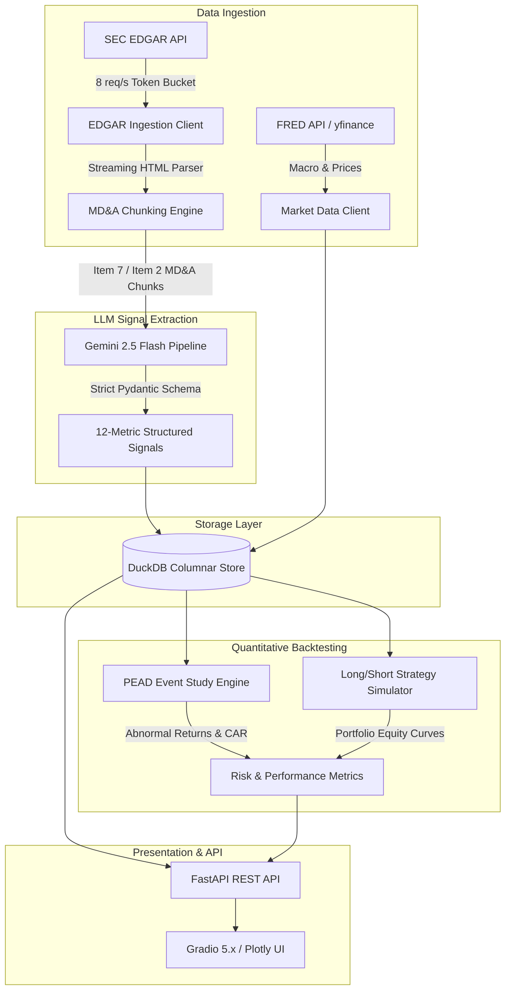

# Financial Earnings Intelligence

[](https://www.python.org/downloads/)
[](https://github.com/astral-sh/uv)
[](https://fastapi.tiangolo.com)
[](https://gradio.app)
[](https://duckdb.org)
[](https://ai.google.dev)
[]()
[](https://github.com/astral-sh/ruff)
[](LICENSE)

An end-to-end system that pulls SEC 10-K/10-Q filings, extracts forward-looking signals from the MD&A section using Gemini 2.5 Flash, and backtests whether those signals predict post-earnings stock price drift.

---

## What This Does

Most quant strategies treat earnings releases as simple EPS beat/miss events. But the real signal is often buried in Item 7 of the filing (MD&A), where management discusses guidance changes, margin outlook, and operational risks in natural language.

This project automates that analysis:

1. **Pulls SEC filings** via EDGAR with proper rate limiting (stays under the 10 req/s Fair Access limit).
2. **Extracts 12 structured signals** from the MD&A text using Gemini 2.5 Flash with strict Pydantic schema enforcement. No free-form text output; the LLM returns validated JSON every time.
3. **Stores everything in DuckDB** for fast local analytics without needing a database server.
4. **Runs event-study backtests** computing Cumulative Abnormal Returns (CAR) against SPY/QQQ/IWM benchmarks, then evaluates trading rules with standard quant metrics (Sharpe, Calmar, drawdown, hit rate).
5. **Serves a web dashboard** (FastAPI + Gradio + Plotly) so you can explore filings, view extracted signals, and visualize backtest results interactively.

---

## Architecture



---

## Methodology

### Event-Study Abnormal Returns

For each filing at event day $t_0$, we build an $N$-day forward window aligned to the benchmark trading calendar (SPY by default).

Daily abnormal return:
$$AR_{i,t} = r_{i,t} - r_{m,t}$$

Cumulative abnormal return:
$$CAR_i(t_0, t) = \sum_{k=t_0}^{t} AR_{i,k}$$

where $r_{i,t}$ and $r_{m,t}$ are the simple daily returns for the stock and benchmark, respectively.

### Trading Rules

Signals from the extraction are mapped to directional positions:

| Direction | Condition 1 | Condition 2 |
| :--- | :--- | :--- |
| **LONG** | Revenue guidance = `raise` | Sentiment $> +0.30$ |
| **LONG** | Forward-looking ratio $> 0.40$ | Margin outlook = `expanding` |
| **SHORT** | Revenue guidance = `lower` | Sentiment $< -0.30$ |
| **SHORT** | Restructuring flags present | Margin outlook = `contracting` |
| **NEUTRAL** | Anything else | Confidence $< 0.70$ |

Short positions mirror returns: $R_{\text{strategy}} = -R_{\text{stock}}$.

### Portfolio Metrics

- **Sharpe**: $\frac{\mathbb{E}[R - R_f]}{\sigma(R - R_f)} \times \sqrt{252 / N_{\text{hold}}}$
- **Max Drawdown**: Peak-to-trough decline in the equity curve
- **Calmar**: Annualized return / |max drawdown|
- **Hit Rate**: Fraction of trades with positive directional return

---

## Extracted Signals (12 Metrics)

Each MD&A section gets analyzed by Gemini 2.5 Flash, which returns a structured `EarningsSignals` object:

| Metric | Type | Values |
| :--- | :--- | :--- |
| `revenue_guidance` | Categorical | `raise`, `maintain`, `lower`, `none` |
| `margin_outlook` | Categorical | `expanding`, `stable`, `contracting`, `none` |
| `capex_plan` | Categorical | `increase`, `maintain`, `decrease`, `none` |
| `hiring_plans` | Categorical | `expanding`, `freezing`, `reducing`, `none` |
| `demand_tone` | Categorical | `strong`, `moderate`, `weak`, `uncertain` |
| `supply_chain_risk` | Categorical | `high`, `moderate`, `low`, `none` |
| `pricing_power` | Categorical | `strong`, `moderate`, `weak`, `none` |
| `regulatory_risk` | Categorical | `high`, `moderate`, `low`, `none` |
| `competitive_risk` | Categorical | `high`, `moderate`, `low`, `none` |
| `management_sentiment_score` | Float | $[-1.0, +1.0]$ tone polarity |
| `forward_looking_ratio` | Float | $[0.0, 1.0]$ share of forward-looking statements |
| `confidence_score` | Float | $[0.0, 1.0]$ model self-assessed confidence |

---

## Getting Started

### Prerequisites

- Python 3.11+
- [uv](https://github.com/astral-sh/uv) package manager
- Git

### Setup

```bash
git clone https://github.com/iuke4/financial-earnings-intelligence.git
cd financial-earnings-intelligence

# Install everything (including dev tools)
uv sync --group dev
uv run pre-commit install

# Set up your credentials
cp .env.example .env
# Then edit .env with your actual API keys
```

Your `.env` needs these values:
```ini
SEC_USER_AGENT="YourApp you@email.com"
GEMINI_API_KEY="your_gemini_key"  # pragma: allowlist secret
FRED_API_KEY="your_fred_key"  # pragma: allowlist secret
DUCKDB_PATH="data/earnings.duckdb"
```

### Ingest Filings

```bash
uv run python scripts/ingest.py --ticker AAPL --forms 10-K
```

### Run a Backtest

```bash
# Use --demo to run with synthetic data (no API keys needed)
uv run python scripts/backtest.py --demo --benchmark SPY --window 30
```

### Launch the Dashboard

```bash
uv run python scripts/serve.py --demo --port 8000
```

Then open:
- Dashboard UI: http://localhost:8000
- API docs (Swagger): http://localhost:8000/docs
- Health check: http://localhost:8000/api/health

---

## Docker

Multi-stage Dockerfile, runs as non-root `appuser`.

```bash
# Quickest way: docker compose with demo data
docker compose up --build
```

Or build manually:
```bash
docker build -t earnings-intel:latest .

docker run -p 8000:8000 \
  -e SEC_USER_AGENT="EarningsApp you@email.com" \
  -e GEMINI_API_KEY="your_key" \
  -e FRED_API_KEY="your_key" \
  earnings-intel:latest --demo
```

---

## API Reference

| Method | Path | Description |
| :--- | :--- | :--- |
| `GET` | `/api/health` | Status + DuckDB row counts |
| `GET` | `/api/filings` | Paginated filings list (filter by `ticker`, `limit`, `offset`) |
| `GET` | `/api/filings/{id}/signals` | Full 12-metric signal payload for a filing |
| `POST` | `/api/filings/{id}/extract` | Trigger Gemini extraction on demand |
| `GET` | `/api/backtests/portfolio` | Run portfolio backtest (`benchmark`, `window_days`, `min_sentiment`, `allow_short`) |
| `GET` | `/api/backtests/{ticker}` | Single-ticker PEAD event study |

---

## Testing & Code Quality

171 tests, 87% coverage. The CI pipeline (GitHub Actions) runs linting, formatting checks, test suite with coverage enforcement, and secret scanning on every push.

```bash
# Run tests
uv run pytest --cov=earnings_intel --cov-fail-under=80

# Lint + format check
uv run ruff check .
uv run ruff format --check .

# All pre-commit hooks
uv run pre-commit run --all-files
```

**Security approach**: All API keys go through Pydantic `SecretStr` (auto-redacted in logs/repr). `detect-secrets` runs as a pre-commit hook and in CI. Ruff is configured with Bandit security rules (`S` group).

---

## Project Layout

```text
financial-earnings-intelligence/
├── .github/workflows/ci.yml    # CI: lint, test, secret scan
├── Dockerfile                  # Multi-stage production build
├── docker-compose.yml          # One-command local deployment
├── pyproject.toml              # PEP 621 config, ruff, pytest
├── scripts/
│   ├── ingest.py               # EDGAR + market data ingestion
│   ├── backtest.py             # Quantitative backtester CLI
│   └── serve.py                # Web server launcher
├── src/earnings_intel/
│   ├── config.py               # Pydantic v2 settings (SecretStr)
│   ├── api/                    # FastAPI routes + Gradio UI
│   ├── backtesting/            # PEAD engine, metrics, strategy rules
│   ├── db/                     # DuckDB schema + connection mgmt
│   ├── edgar/                  # SEC EDGAR client + HTML parser
│   ├── extraction/             # Gemini pipeline + Pydantic schemas
│   └── market_data/            # FRED + yfinance integrations
└── tests/                      # 171 unit + integration tests
```

---

## License

MIT. See [LICENSE](LICENSE).
