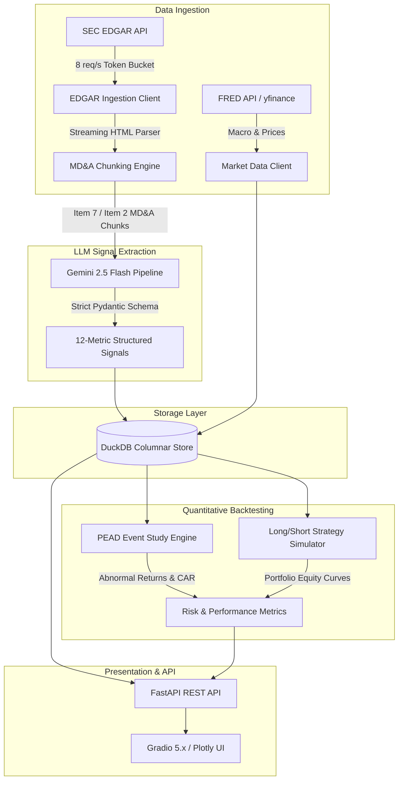

# Financial Earnings Intelligence (FEI)

[](https://www.python.org/downloads/)
[](https://github.com/astral-sh/uv)
[](https://fastapi.tiangolo.com)
[](https://gradio.app)
[](https://duckdb.org)
[](https://ai.google.dev)
[]()
[](https://github.com/astral-sh/ruff)
[](https://github.com/Yelp/detect-secrets)
[](LICENSE)

An enterprise-grade, end-to-end quantitative finance and natural language processing system that extracts forward-looking qualitative intelligence from SEC 10-K and 10-Q filings via Gemini 2.5 Flash structured output, tracks market sentiment shifts, and backtests Post-Earnings Announcement Drift (PEAD) alpha strategies against benchmark market data.

---

## Executive Summary & Recruiter Hook

Traditional quantitative strategies often treat earnings releases as binary, backward-looking EPS surprises. However, institutional hedge funds derive durable alpha by evaluating the **qualitative nuances, forward guidance shifts, and risk sentiment** buried within Item 7 (MD&A — *Management's Discussion and Analysis of Financial Condition and Results of Operations*).

**Financial Earnings Intelligence** bridges modern generative AI and quantitative equity research:
1. **Compliant SEC EDGAR Ingestion**: Asynchronous token-bucket rate limiter adhering strictly to the SEC Fair Access policy ($\le 8\text{ req/s}$) with automated CIK normalization and streaming MD&A extraction.
2. **Deterministic LLM Structured Extraction**: Enforces strict Pydantic v2 schemas over Gemini 2.5 Flash to extract 12 structured metrics (revenue guidance, margin outlook, capex plans, supply chain risks, tone sentiment, and forward-looking language ratios) with zero schema drift.
3. **Columnar In-Process Analytics**: DuckDB embedded database engine enabling sub-millisecond aggregations, cross-sectional joins, and zero-dependency local analytics.
4. **Post-Earnings Announcement Drift (PEAD) Engine**: Calculates event-study Cumulative Abnormal Returns ($CAR$) against customizable equity benchmarks (**SPY**, **QQQ**, **IWM**).
5. **Quantitative Strategy Simulator**: Implements directional long/short entry rules based on forward guidance raises, sentiment thresholds, and restructuring flags, computing portfolio Sharpe, Calmar, hit rates, and underwater drawdown curves.
6. **Unified Web Application**: FastAPI analytical backend paired with a Gradio 5.x interactive UI and Plotly financial charts, distributed via multi-stage Docker containers.
7. **Zero-Leak Security Architecture**: Pydantic `SecretStr` redaction, automated pre-commit secret scans (`detect-secrets`), Bandit security linter (`S` rules), and sanitized environment templates.

---

## System Architecture



---

## Quantitative Methodology

### 1. Event-Study Abnormal Returns & PEAD
For each corporate filing announcement $i$ at event trading day $t_0$, the system constructs an $N$-day forward event window ($t \in [t_0, t_0 + N]$) synchronized with the trading calendar of the benchmark index (defaulting to S&P 500 ETF: `SPY`, or Nasdaq 100: `QQQ`, Russell 2000: `IWM`).

Daily asset return:
$$r_{i,t} = \frac{P_{i,t}}{P_{i,t-1}} - 1$$

Daily benchmark return:
$$r_{m,t} = \frac{P_{m,t}}{P_{m,t-1}} - 1$$

Daily Abnormal Return ($AR$):
$$AR_{i,t} = r_{i,t} - r_{m,t}$$

Cumulative Abnormal Return ($CAR$):
$$CAR_i(t_0, t) = \sum_{k=t_0}^t AR_{i,k}$$

### 2. Signal Rule Matrix
The strategy engine evaluates extracted signals to categorize trading posture:

| Stance | Condition 1 | Condition 2 | Rationale |
| :--- | :--- | :--- | :--- |
| **LONG** | Revenue Guidance = `raise` | Sentiment Score $> +0.30$ | Upward fundamental revision with optimistic management tone. |
| **LONG** | Forward-Looking Ratio $> 0.40$ | Margin Outlook = `expanding` | High forward disclosure clarity combined with structural margin expansion. |
| **SHORT** | Revenue Guidance = `lower` | Sentiment Score $< -0.30$ | Deteriorating top-line guidance with negative qualitative commentary. |
| **SHORT** | Restructuring Flags = `True` | Margin Outlook = `contracting` | Operational distress and margin contraction. |
| **NEUTRAL**| Any / Fallback | Confidence $< 0.70$ | Mixed signals or insufficient extraction model confidence. |

For `SHORT` positions, returns and abnormal returns are directionally mirrored ($R_{\text{strategy}} = -R_{\text{stock}}$).

### 3. Portfolio Risk & Performance Metrics
- **Annualized Sharpe Ratio**:
  $$\text{Sharpe} = \frac{\mathbb{E}[R - R_f]}{\sigma(R - R_f)} \times \sqrt{\frac{252}{N_{\text{holding}}}}$$
- **Peak-to-Trough Maximum Drawdown (MDD)**:
  $$\text{Drawdown}_t = \frac{\text{Equity}_t - \max_{0 \le s \le t} \text{Equity}_s}{\max_{0 \le s \le t} \text{Equity}_s}$$
- **Calmar Ratio**:
  $$\text{Calmar} = \frac{R_{\text{ann}}}{|\text{MDD}|}$$
- **Hit Rate**: Ratio of trades where directional strategy return $> 0$.

---

## Extracted Signal Schema (12 Metrics)

Every filing MD&A is decomposed and analyzed by Gemini 2.5 Flash to generate an `EarningsSignals` record:

| Metric | Type | Description / Domain |
| :--- | :--- | :--- |
| `revenue_guidance` | Categorical | `raise`, `maintain`, `lower`, `none` |
| `margin_outlook` | Categorical | `expanding`, `stable`, `contracting`, `none` |
| `capex_plan` | Categorical | `increase`, `maintain`, `decrease`, `none` |
| `hiring_plans` | Categorical | `expanding`, `freezing`, `reducing`, `none` |
| `demand_tone` | Categorical | `strong`, `moderate`, `weak`, `uncertain` |
| `supply_chain_risk` | Categorical | `high`, `moderate`, `low`, `none` |
| `pricing_power` | Categorical | `strong`, `moderate`, `weak`, `none` |
| `regulatory_risk` | Categorical | `high`, `moderate`, `low`, `none` |
| `competitive_risk` | Categorical | `high`, `moderate`, `low`, `none` |
| `management_sentiment_score` | Float | $[-1.0, +1.0]$ Continuous tone polarity index |
| `forward_looking_ratio` | Float | $[0.0, 1.0]$ Proportion of predictive statements |
| `confidence_score` | Float | $[0.0, 1.0]$ Self-assessed extraction confidence |

---

## Quickstart Guide

### Prerequisites
- Python 3.11+
- [uv](https://github.com/astral-sh/uv) (ultra-fast Python package and project manager)
- Git

### 1. Installation & Environment Setup

```bash
# Clone repository
git clone https://github.com/iuke4/financial-earnings-intelligence.git
cd financial-earnings-intelligence

# Install dependencies and pre-commit hooks via uv
uv sync --group dev
uv run pre-commit install

# Configure environment variables
cp .env.example .env
```

Edit `.env` with your API keys:
```ini
SEC_USER_AGENT="YourApp user@domain.com"
GEMINI_API_KEY="your_gemini_api_key_here"
FRED_API_KEY="your_fred_api_key_here"
DUCKDB_PATH="data/earnings.duckdb"
LOG_LEVEL="INFO"
```

### 2. Ingest SEC Filings & Market Data

```bash
# Fetch Apple (AAPL) 10-K filings and price history into DuckDB
uv run python scripts/ingest.py --ticker AAPL --forms 10-K
```

### 3. Run Quantitative Backtests

```bash
# Execute backtest on real data or instant synthetic demo mode
uv run python scripts/backtest.py --demo --benchmark SPY --window 30
```

### 4. Launch Interactive Web Dashboard

```bash
# Start FastAPI backend + Gradio UI with demo data seeding
uv run python scripts/serve.py --demo --port 8000
```

Open your browser:
- **Interactive UI**: [http://localhost:8000](http://localhost:8000)
- **Interactive Swagger Docs**: [http://localhost:8000/docs](http://localhost:8000/docs)
- **Alternative ReDoc**: [http://localhost:8000/redoc](http://localhost:8000/redoc)
- **Health Check**: [http://localhost:8000/api/health](http://localhost:8000/api/health)

---

## Docker & Container Deployment

The application features a production-ready, multi-stage Docker build running under an unprivileged `appuser`.

### Run via Docker Compose
```bash
# Build and start container with persistent DuckDB volume and demo data
docker compose up --build
```
Access the application at `http://localhost:8000`.

### Build & Run Manually
```bash
# Build production image
docker build -t earnings-intel:latest .

# Run container
docker run -p 8000:8000 \
  -e SEC_USER_AGENT="EarningsApp user@domain.com" \
  -e GEMINI_API_KEY="your_key" \
  -e FRED_API_KEY="your_key" \
  earnings-intel:latest --demo
```

---

## REST API Reference

| Method | Path | Description | Query Parameters |
| :--- | :--- | :--- | :--- |
| `GET` | `/api/health` | System status & DuckDB row counts | None |
| `GET` | `/api/filings` | Paginated filing catalog | `ticker`, `limit` (default 50), `offset` (default 0) |
| `GET` | `/api/filings/{id}/signals` | Full 12-metric signal payload | Path parameter: `filing_id` |
| `POST` | `/api/filings/{id}/extract` | Trigger on-demand Gemini extraction | Path parameter: `filing_id` |
| `GET` | `/api/backtests/portfolio` | Multi-strategy portfolio simulation | `benchmark` (`SPY`/`QQQ`/`IWM`), `window_days`, `min_sentiment`, `min_forward_ratio`, `allow_short` |
| `GET` | `/api/backtests/{ticker}` | Ticker PEAD event study & CAR series | `ticker`, `benchmark`, `window_days` |

---

## Code Quality & Security Architecture

This repository strictly enforces production development standards:

- **Zero-Leak Credential Policy**: All secrets are encapsulated within Pydantic `SecretStr`, preventing exposure in log files, terminal outputs, or serializations.
- **Automated Secret Scanning**: Yelp `detect-secrets` actively monitors git staging diffs and enforces pre-commit blocking against credential slips.
- **Security & Bandit Audits**: Ruff linter configured with `S` (Bandit security checks), `B` (Bugbear), `RUF`, and `UP` (pyupgrade) rule groups.
- **Automated CI/CD**: GitHub Actions workflow (`.github/workflows/ci.yml`) validates code formatting, linting, secret detection, and runs the entire test suite with coverage enforcement.
- **Extensive Test Suite**: **171 unit and integration tests** achieving **87% overall test coverage**:

```bash
# Run test suite with coverage verification
uv run pytest --cov=earnings_intel --cov-report=term-missing --cov-fail-under=80

# Run linters and formatters
uv run ruff check .
uv run ruff format --check .

# Run pre-commit audit
uv run pre-commit run --all-files
```

---

## Repository Structure

```text
financial-earnings-intelligence/
├── .github/
│   └── workflows/
│       └── ci.yml             # GitHub Actions CI pipeline
├── .pre-commit-config.yaml    # Pre-commit hooks (ruff, detect-secrets, YAML/TOML)
├── .secrets.baseline          # Secret detection fingerprint baseline
├── .dockerignore              # Docker build exclusions
├── Dockerfile                 # Multi-stage production container build
├── docker-compose.yml         # Containerized runtime configuration
├── pyproject.toml             # uv / PEP 621 project configuration & tool configs
├── PROJECT_PLAN.md            # Comprehensive system blueprint & roadmap
├── README.md                  # System overview & technical documentation
├── scripts/
│   ├── ingest.py              # SEC EDGAR & market data ingestion CLI
│   ├── backtest.py            # Quantitative backtester CLI
│   └── serve.py               # FastAPI & Gradio server launcher
├── src/
│   └── earnings_intel/
│       ├── config.py          # Centralized Pydantic v2 Settings
│       ├── api/               # FastAPI backend & Gradio 5.x interface
│       │   ├── routes.py      # REST endpoints & DuckDB query handlers
│       │   ├── ui.py          # Gradio tabs & Plotly chart builders
│       │   └── main.py        # Application factory & lifespan handlers
│       ├── backtesting/       # Quantitative PEAD & strategy simulation
│       │   ├── pead.py        # Abnormal returns & CAR event studies
│       │   ├── metrics.py     # Sharpe, Calmar, hit rate, max drawdown
│       │   └── engine.py      # Long/short rule filters & trade log storage
│       ├── db/                # DuckDB schema and connection management
│       ├── edgar/             # SEC EDGAR Fair Access streaming client
│       ├── extraction/        # Gemini 2.5 Flash structured pipeline
│       └── market_data/       # FRED and yfinance historical integrations
└── tests/                     # 171 automated unit and integration tests
    ├── test_api/              # FastAPI & Gradio test suite
    ├── test_backtesting/      # PEAD & quantitative metrics tests
    ├── test_edgar/            # SEC ingestion & parser tests
    ├── test_extraction/       # Gemini mock pipeline & schema tests
    └── test_market_data/      # Macro & price ingest tests
```

---

## License

This project is licensed under the MIT License — see the [LICENSE](LICENSE) file for details.
